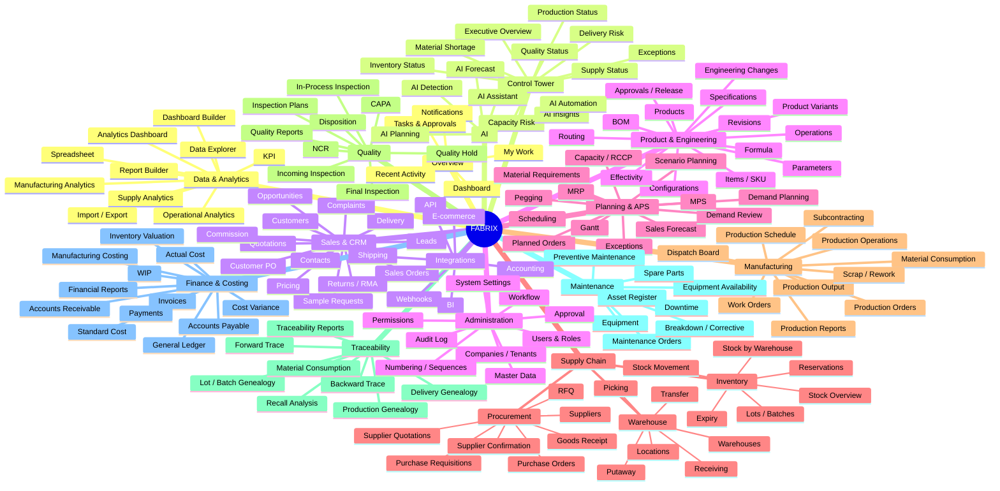
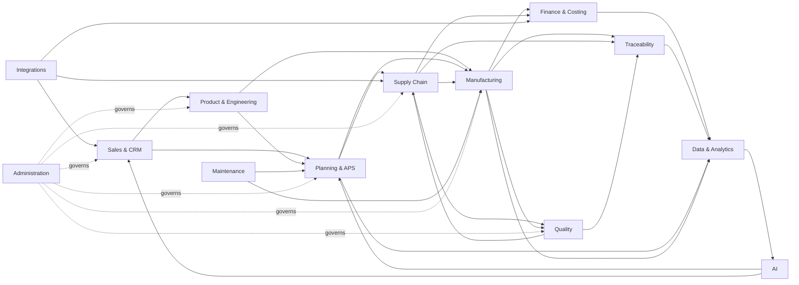
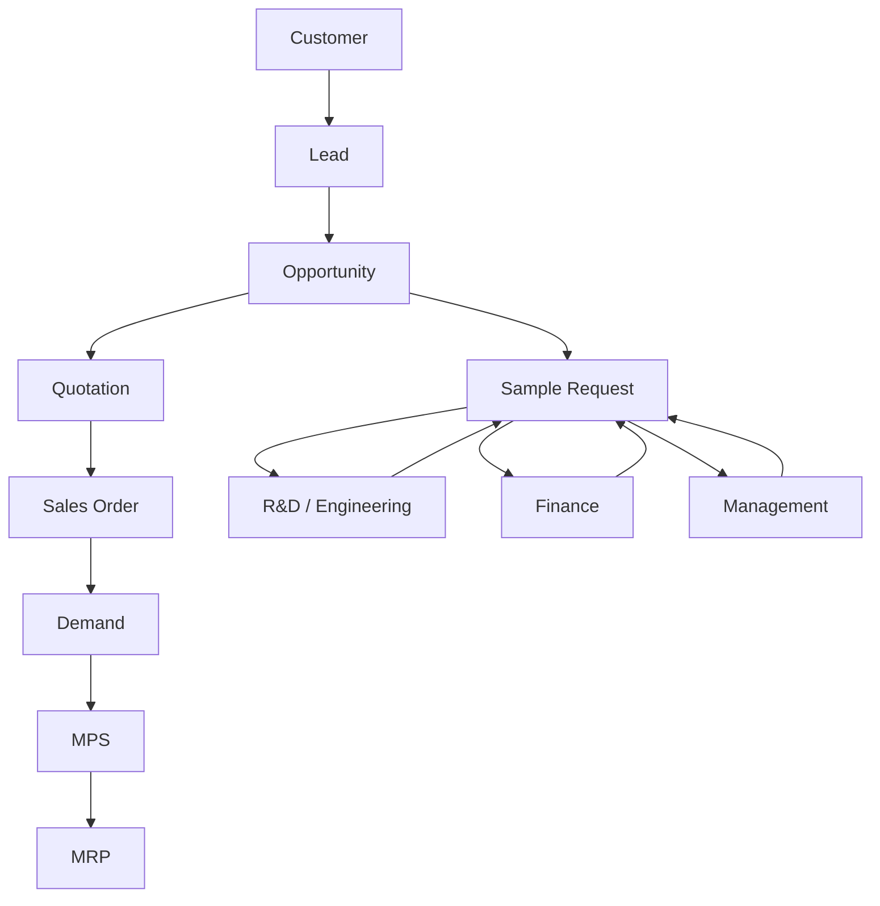
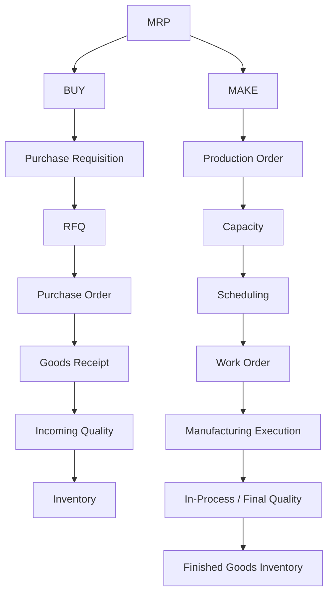
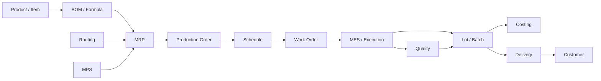
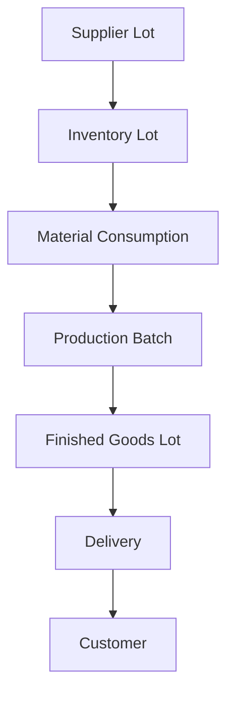
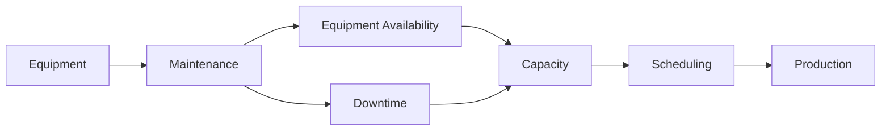
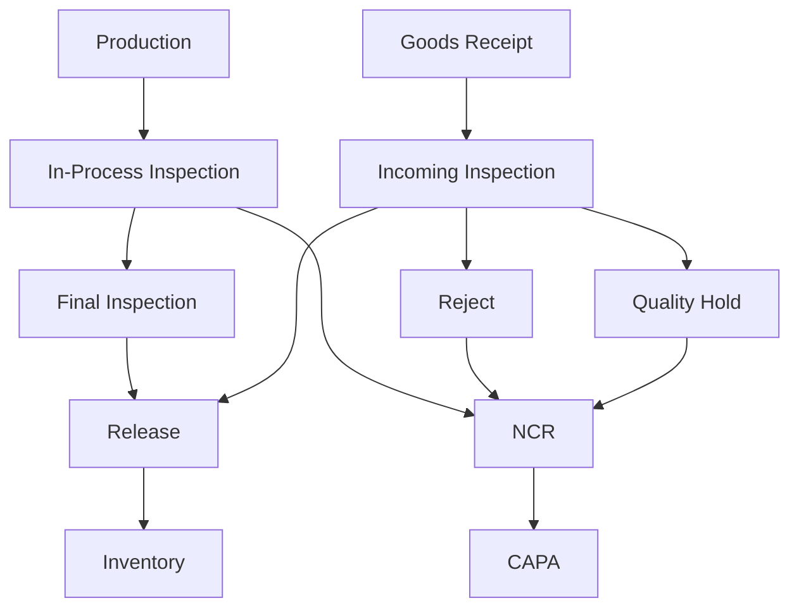
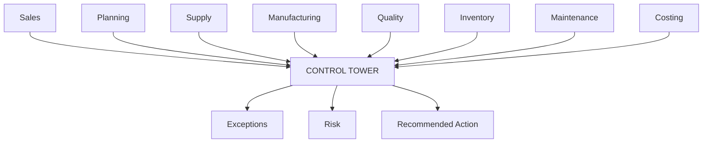

# FABRIX — UX / INFORMATION ARCHITECTURE v1.0

## Master UX Navigation, Sitemap & Cross-Domain User Flow

**Status:** UX Architecture Baseline  
**Audience:** Product Owner → Claude Fable 5 → Claude Opus 5 → Claude Code  
**Scope:** FABRIX Information Architecture  
**Master Architecture:** `01 UX / Information Architecture`

---

# 1. Purpose

This document defines the proposed UX / Information Architecture for FABRIX.

FABRIX is not positioned as a traditional ERP with a collection of independent administrative modules.

FABRIX is a manufacturing operating system covering:

- Commercial
- Product & Engineering
- Planning & APS
- Supply Chain / Procurement
- Manufacturing
- Quality
- Traceability
- Maintenance
- Costing & Finance
- Data & Analytics
- AI
- Integrations
- Administration

The UX must make these capabilities discoverable without exposing internal technical/domain architecture unnecessarily.

---

# 2. Core UX Principle

The fundamental separation is:

```text
UX / INFORMATION ARCHITECTURE
        ↓
BUSINESS DOMAIN ARCHITECTURE
        ↓
TECHNICAL ARCHITECTURE
```

Therefore:

```text
UX MENU ≠ DOMAIN
UX MENU ≠ DATABASE
UX MENU ≠ SERVICE
UX MENU ≠ MICROSERVICE
```

Example:

```text
UX:
Manufacturing → BOM

Domain:
Product & Engineering → BOM
```

This is intentional.

---

# 3. FABRIX Top-Level Navigation

```text
FABRIX
│
├── 🏠 Overview
├── 🎯 Control Tower
├── 💼 Sales & CRM
├── 🧩 Product & Engineering
├── 📅 Planning & APS
├── 📦 Supply Chain
├── 🏭 Manufacturing
├── 🔍 Quality
├── 🔗 Traceability
├── 🔧 Maintenance
├── 💰 Finance & Costing
├── 📊 Data & Analytics
├── ✨ AI
├── 🔌 Integrations
└── ⚙️ Administration
```

---

# 4. Overview

```text
🏠 Overview
├── Dashboard
├── My Work
├── Notifications
├── Tasks & Approvals
└── Recent Activity
```

Purpose:

> What needs my attention right now?

Overview should not become another duplicate reporting system.

---

# 5. Control Tower

```text
🎯 Control Tower
├── Executive Overview
├── Production Status
├── Supply Status
├── Inventory Status
├── Quality Status
├── Delivery Risk
├── Capacity Risk
├── Material Shortage
└── Exceptions
```

Control Tower emphasizes:

```text
STATUS
RISK
EXCEPTION
IMPACT
ACTION
```

It is not the source of operational state.

---

# 6. Sales & CRM

```text
💼 Sales & CRM
├── Dashboard
├── Leads
├── Opportunities
├── Customers
├── Contacts
├── Sample Requests
├── Quotations
├── Customer PO
├── Sales Orders
├── Pricing
├── Delivery
├── Returns / RMA
├── Complaints
└── Commission
```

### FABRIX-specific Sample Request flow

```text
Sales
 ↓
Sample Request
 ├── Free Sample
 └── Paid Sample
       ↓
   Finance
       ↓
      R&D / Engineering
       ↓
  Management Approval
       ↓
Sample Production / Fulfillment
       ↓
Customer
```

The UX should expose status and responsibility across departments without forcing Sales to manage each department's internal workflow.

---

# 7. Product & Engineering

```text
🧩 Product & Engineering
├── Products
├── Items / SKU
├── Product Variants
├── Configurations
├── Parameters
├── BOM
├── Formula
├── Routing
├── Operations
├── Specifications
├── Revisions
├── Effectivity
├── Engineering Changes
└── Approvals / Release
```

Responsibility:

> What is the product and how is it defined for manufacturing?

Engineering owns the authoritative manufacturing definition.

---

# 8. Planning & APS

```text
📅 Planning & APS
├── Planning Dashboard
├── Demand Planning
├── Sales Forecast
├── Demand Review
├── MPS
├── MRP
├── Material Requirements
├── Planned Orders
├── Capacity / RCCP
├── Scheduling
├── Gantt
├── Scenario Planning
├── Pegging
└── Exceptions
```

Planning answers:

```text
What is needed?
How much?
When?
Can we make it?
Can we buy it?
What is the capacity impact?
```

Gantt is a visualization of scheduling semantics, not the scheduling engine itself.

---

# 9. Supply Chain

Supply Chain combines user-facing inventory, warehouse and procurement workflows while preserving separate domain ownership.

```text
📦 Supply Chain
│
├── Inventory
│   ├── Stock Overview
│   ├── Stock by Warehouse
│   ├── Stock Movement
│   ├── Reservations
│   ├── Lots / Batches
│   └── Expiry
│
├── Warehouse
│   ├── Warehouses
│   ├── Locations
│   ├── Receiving
│   ├── Picking
│   ├── Putaway
│   └── Transfer
│
└── Procurement
    ├── Suppliers
    ├── Purchase Requisitions
    ├── RFQ
    ├── Supplier Quotations
    ├── Purchase Orders
    ├── Supplier Confirmation
    └── Goods Receipt
```

Procurement remains a distinct business domain even though it is grouped under Supply Chain in UX.

---

# 10. Manufacturing

```text
🏭 Manufacturing
├── Manufacturing Dashboard
├── Production Orders
├── Work Orders
├── Production Schedule
├── Dispatch Board
├── Production Operations
├── Material Consumption
├── Production Output
├── Scrap / Rework
├── Subcontracting
└── Production Reports
```

Manufacturing answers:

> How do we execute the production intent?

---

# 11. Quality

```text
🔍 Quality
├── Quality Dashboard
├── Inspection Plans
├── Incoming Inspection
├── In-Process Inspection
├── Final Inspection
├── Quality Hold
├── NCR
├── CAPA
├── Disposition
└── Quality Reports
```

Quality owns quality disposition.

Receiving does not automatically mean material is released to available stock.

---

# 12. Traceability

Traceability is exposed as its own workspace because it is a cross-domain manufacturing capability.

```text
🔗 Traceability
├── Traceability Dashboard
├── Lot / Batch Genealogy
├── Forward Trace
├── Backward Trace
├── Material Consumption
├── Production Genealogy
├── Delivery Genealogy
├── Recall Analysis
└── Traceability Reports
```

Users should be able to answer:

```text
Where did this material come from?
Where did this batch go?
Which customers received it?
Which raw materials went into this finished product?
```

---

# 13. Maintenance

```text
🔧 Maintenance
├── Maintenance Dashboard
├── Equipment
├── Asset Register
├── Preventive Maintenance
├── Maintenance Orders
├── Breakdown / Corrective
├── Downtime
├── Equipment Availability
└── Spare Parts
```

Relationship:

```text
Equipment
 ↓
Maintenance
 ↓
Equipment Availability
 ↓
Capacity
 ↓
Scheduling
 ↓
Production
```

---

# 14. Finance & Costing

```text
💰 Finance & Costing
├── Finance Dashboard
├── Accounts Receivable
├── Accounts Payable
├── Invoices
├── Payments
├── General Ledger
├── Manufacturing Costing
├── Standard Cost
├── Actual Cost
├── WIP
├── Inventory Valuation
├── Cost Variance
└── Financial Reports
```

UX groups Finance and Costing for user context, while domain ownership remains separate:

```text
Costing
→ manufacturing cost

Finance
→ accounting
```

---

# 15. Data & Analytics

```text
📊 Data & Analytics
├── Analytics Dashboard
├── Spreadsheet
├── Data Explorer
├── Report Builder
├── Dashboard Builder
├── KPI
├── Operational Analytics
├── Manufacturing Analytics
├── Supply Analytics
└── Import / Export
```

Analytics is a derived information layer and must not become the operational source of truth.

---

# 16. AI

```text
✨ AI
├── AI Assistant
├── AI Insights
├── AI Forecast
├── AI Planning
├── AI Detection
└── AI Automation
```

AI should operate under:

```text
Context
 ↓
Recommendation
 ↓
Human / Workflow Governance
 ↓
Authorized Action
```

AI must not silently mutate consequential operational state.

---

# 17. Integrations

```text
🔌 Integrations
├── API
├── Webhooks
├── E-commerce
├── Accounting
├── Shipping
└── BI
```

---

# 18. Administration

```text
⚙️ Administration
├── Master Data
├── Users & Roles
├── Companies / Tenants
├── Permissions
├── Approval
├── Workflow
├── Audit Log
├── Numbering / Sequences
└── System Settings
```

---

# 19. Full Sitemap



---

# 20. Top-Level Domain Flow



---

# 21. Canonical User Journey — Sales to Manufacturing



---

# 22. MRP Buy / Make Flow



---

# 23. Manufacturing Digital Thread



---

# 24. Traceability User Flow



Both directions must be supported:

```text
FORWARD TRACE
Supplier Lot → Production → FG Lot → Delivery → Customer
```

```text
BACKWARD TRACE
Customer → Delivery → FG Lot → Production Batch → Material Consumption → Supplier Lot
```

---

# 25. Maintenance to Production Flow



---

# 26. Quality Flow



---

# 27. Control Tower Flow



---

# 28. Entity-Centric UX

FABRIX should support navigation from entities rather than forcing users to think in modules.

Example:

```text
Customer
 ↓
Sales Orders
 ↓
Deliveries
 ↓
Complaints
 ↓
Traceability
```

Another:

```text
Item
 ↓
Inventory
 ↓
BOM
 ↓
Routing
 ↓
MRP
 ↓
Production
 ↓
Quality
 ↓
Cost
```

Another:

```text
Production Order
 ↓
Work Orders
 ↓
Material Consumption
 ↓
Quality
 ↓
Batch
 ↓
Cost
```

---

# 29. List → Detail → Related Pattern

Major entities should follow:

```text
LIST
 ↓
DETAIL
 ↓
RELATED
 ↓
TIMELINE
 ↓
ACTIONS
```

Example:

```text
Production Orders
 ↓
Production Order Detail
 ├── Overview
 ├── Materials
 ├── Operations
 ├── Schedule
 ├── Quality
 ├── Batch / Traceability
 ├── Cost
 ├── Documents
 └── Timeline
```

---

# 30. Timeline Pattern

Important transactional entities should expose an auditable timeline:

```text
Created
 ↓
Submitted
 ↓
Approved
 ↓
Released
 ↓
Scheduled
 ↓
Executed
 ↓
Quality
 ↓
Completed
 ↓
Closed
```

Exact timeline depends on the entity's state machine.

---

# 31. Exception-First UX

FABRIX should not force users to inspect every transaction to discover problems.

Examples:

```text
Material Shortage
Capacity Conflict
Late Supplier
Quality Failure
Production Delay
Equipment Downtime
Delivery Risk
Cost Variance
Traceability Gap
Approval Pending
```

Surface them through:

```text
Overview
Control Tower
Domain Dashboard
Notifications
Tasks
Exception Views
```

---

# 32. Role-Based UX

Navigation visibility should adapt to role and permission.

Example:

```text
Planner
→ Planning & APS
→ Supply Chain
→ Control Tower

Production Manager
→ Manufacturing
→ Planning & APS
→ Quality
→ Control Tower

Warehouse
→ Supply Chain
→ Quality

Quality
→ Quality
→ Traceability
→ Supply Chain

Finance
→ Finance & Costing
→ Sales
→ Supply Chain

Sales
→ Sales & CRM
→ Overview
→ Control Tower
```

These are examples, not a final permission matrix.

---

# 33. UX vs Domain Ownership

| UX Workspace | Primary Domain Ownership | Related Domains |
|---|---|---|
| Sales & CRM | Commercial | Engineering, Planning, Finance |
| Product & Engineering | Product / Engineering | Manufacturing, Planning, Costing |
| Planning & APS | Planning | Sales, Engineering, Supply, Manufacturing, Maintenance |
| Supply Chain | Supply Chain / Procurement | Planning, Quality, Traceability |
| Manufacturing | Manufacturing | Engineering, Planning, Quality, Traceability, Costing |
| Quality | Quality | Procurement, Manufacturing, Inventory, Traceability |
| Traceability | Traceability | Inventory, Manufacturing, Quality, Delivery |
| Maintenance | Maintenance | Manufacturing, Planning |
| Finance & Costing | Finance / Costing | Sales, Inventory, Manufacturing |
| Data & Analytics | Analytics | All domains |
| AI | AI | All domains |
| Integrations | Integration | External systems / relevant domains |
| Administration | Platform | All domains |

---

# 34. UX Design Rules

### Rule 1 — Do not expose architecture jargon unnecessarily

Avoid exposing:

```text
Domain Service
Aggregate
Event Bus
Repository
Saga
```

unless relevant to advanced technical/admin interfaces.

### Rule 2 — Use manufacturing language

Prefer:

```text
Production Order
Work Order
Material Requirement
Purchase Order
Inspection
Batch
Lot
Schedule
```

over implementation names.

### Rule 3 — Context follows the user

Users should be able to move from:

```text
Production Order
 → Material
 → Lot
 → Quality
 → Supplier
```

without losing context.

### Rule 4 — Actions respect ownership

A Sales Order page may show:

```text
Inventory status
Production status
Delivery status
Payment status
```

but should not directly mutate Inventory or Production state outside an authorized workflow.

---

# 35. What Should Not Be Top-Level UX

These should generally remain capabilities inside relevant workspaces:

```text
MRP Engine
Event Bus
Domain Services
API Gateway
Database
Repositories
Background Jobs
Message Queue
Workflow Engine
```

They belong to technical architecture, not user navigation.

---

# 36. Future MES Boundary

MES should only become a definitive UX workspace after MES architecture is mature.

Potential future structure:

```text
🏭 Manufacturing
├── Production Orders
├── Work Orders
├── Scheduling
├── Dispatch
└── Shop Floor

MES
├── Operator Terminal
├── Machine / Work Center
├── Execution
├── Downtime
├── Material Consumption
├── Production Output
├── Digital Work Instructions
└── Real-Time Monitoring
```

Whether MES becomes a separate top-level workspace or remains embedded in Manufacturing must be decided during MES architecture review.

Do not prematurely lock this decision.

---

# 37. Architecture Maturity Rule

This document is:

> **UX Architecture Baseline v1.0**

It is not a pixel-level UI specification.

Before final implementation, Fable 5 must validate:

```text
UX
 ↓
Actual User Workflow
 ↓
Domain Ownership
 ↓
Existing Implementation
 ↓
Permissions
 ↓
State Machines
 ↓
Technical Feasibility
```

---

# 38. Fable 5 Review Questions

Fable 5 must review:

1. Is every top-level workspace justified?
2. Are any workspaces duplicated?
3. Should Procurement remain under Supply Chain?
4. Should Traceability remain top-level?
5. Should Finance and Costing be grouped?
6. Should MES eventually be top-level or remain under Manufacturing?
7. Are any menu items actually technical concepts?
8. Are important business workflows missing?
9. Does the UX match actual FABRIX users?
10. Does role-based navigation create excessive fragmentation?
11. Are cross-domain navigation paths clear?
12. Are entity-centric workflows adequately supported?
13. Are exception workflows visible?
14. Does Control Tower have a distinct purpose?
15. Are AI capabilities appropriately placed?
16. Does the UX remain scalable as FABRIX adds modules?

---

# 39. Required Fable 5 Output

```text
1. UX Architecture Assessment
2. Sitemap Critique
3. Workspace Boundary Review
4. Role / Persona Navigation Review
5. Entity-Centric Navigation Review
6. Cross-Domain Flow Review
7. Exception UX Review
8. Control Tower Review
9. MES UX Boundary Recommendation
10. Missing UX Capabilities
11. Redundant UX Capabilities
12. Recommended Sitemap Changes
13. Final UX Architecture
14. UX → Domain Mapping
15. UX → Permission Mapping
16. UX → State / Workflow Mapping
```

---

# 40. Final Recommended FABRIX UX

```text
🏠 Overview
🎯 Control Tower

💼 Sales & CRM
🧩 Product & Engineering
📅 Planning & APS
📦 Supply Chain
🏭 Manufacturing
🔍 Quality
🔗 Traceability
🔧 Maintenance
💰 Finance & Costing

📊 Data & Analytics
✨ AI
🔌 Integrations
⚙️ Administration
```

---

# 41. Final Principle

FABRIX should feel to a user like:

> **One manufacturing operating system**

not:

> **A collection of ERP modules**

The UX should make the workflow feel continuous:

```text
Customer
 ↓
Demand
 ↓
Plan
 ↓
Material / Capacity
 ↓
Procurement / Production
 ↓
Quality
 ↓
Inventory
 ↓
Traceability
 ↓
Delivery
 ↓
Cost
 ↓
Finance
 ↓
Insight
 ↓
Decision
```

while the underlying architecture preserves strict domain ownership.

---

# 42. Handoff

This document belongs to:

```text
FABRIX MASTER ARCHITECTURE
└── 01 UX / Information Architecture
```

Review together with:

```text
02 Domain Architecture
03 Sales Architecture
Post-Sales Architecture Reconciliation
```

Fable 5 should reconcile this UX architecture with the actual running FABRIX implementation before Opus 5 converts the approved architecture into technical implementation instructions.

**END OF DOCUMENT**
